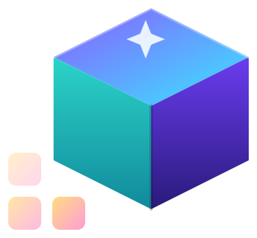

<div align="center">



# img2threejs

**Rebuild the object in a reference image as a code-only, procedural Three.js model.**

Quality-gated, animation-ready, and deliberately token-efficient — reconstruction-by-code, not photogrammetry, mesh extraction, or downloaded art packs.

[](LICENSE)
[](https://github.com/img2threejs/img2threejs/releases)
[](CONTRIBUTING.md)
[](https://threejs.org)
[](scripts)
[](https://www.buymeacoffee.com/hoainhowors)

<table align="center">
  <tr>
    <td align="center"></td>
    <td align="center"><sub><b>DAILY</b></sub></td>
    <td align="center"><sub><b>WEEKLY</b></sub></td>
  </tr>
  <tr>
    <td align="right"><sub><b>Python</b></sub></td>
    <td><a href="https://trendshift.io/repositories/83608?utm_source=trendshift-badge&amp;utm_medium=badge&amp;utm_campaign=badge-trendshift-83608" target="_blank" rel="noopener noreferrer"></a></td>
    <td><a href="https://trendshift.io/repositories/83608?utm_source=trendshift-badge&amp;utm_medium=badge&amp;utm_campaign=badge-trendshift-83608" target="_blank" rel="noopener noreferrer"></a></td>
  </tr>
  <tr>
    <td align="right"><sub><b>All languages</b></sub></td>
    <td><a href="https://trendshift.io/repositories/83608?utm_source=trendshift-badge&amp;utm_medium=badge&amp;utm_campaign=badge-trendshift-83608" target="_blank" rel="noopener noreferrer"></a></td>
    <td><a href="https://trendshift.io/repositories/83608?utm_source=trendshift-badge&amp;utm_medium=badge&amp;utm_campaign=badge-trendshift-83608" target="_blank" rel="noopener noreferrer"></a></td>
  </tr>
</table>

</div>

*Reference images reconstructed in code as animation-ready Three.js models, running live in the browser.*

### [→ Open the Live Demo Gallery](https://img2threejs.github.io/img2threejs-showcase/)

Every model in the gallery is generated code, running in your browser. No mesh files, no downloads.

---

## Live demos

Reconstructions built entirely from primitives, procedural shaders, and generated geometry. Open any model to orbit it, inspect its reference, and read the generated source.

| Demo | Subject | View | Source |
| --- | --- | --- | --- |
| Glock-18 · Ghost Protocol (Well-Worn) | CS2 weapon | [Live](https://img2threejs.github.io/img2threejs-showcase/#/demo/glock-ghost-protocol) | [code](https://github.com/img2threejs/img2threejs-showcase/blob/main/src/demos/glock-ghost-protocol/createGlockGhostProtocolModel.ts) |
| Classic Knife · Fade (Minimal Wear) | CS2 weapon | [Live](https://img2threejs.github.io/img2threejs-showcase/#/demo/classic-fade) | [code](https://github.com/img2threejs/img2threejs-showcase/blob/main/src/demos/classic-fade/createClassicFadeModel.ts) |
| BMX Endurance Bike | hard-surface object | [Live](https://img2threejs.github.io/img2threejs-showcase/#/demo/bmx-endurance) | [code](https://github.com/img2threejs/img2threejs-showcase/blob/main/src/demos/bmx-endurance/createBmxEnduranceBikeModel.ts) |
| M9 Bayonet · Doppler Phase 2 | CS2 weapon | [Live](https://img2threejs.github.io/img2threejs-showcase/#/demo/m9-doppler) | [code](https://github.com/img2threejs/img2threejs-showcase/blob/main/src/demos/m9-doppler/createM9DopplerModel.ts) |
| Sony WF-1000XM3 Earbuds + Case | hard-surface object | [Live](https://img2threejs.github.io/img2threejs-showcase/#/demo/sony-wf1000xm3) | [code](https://github.com/img2threejs/img2threejs-showcase/blob/main/src/demos/sony-wf1000xm3/createSonyWf1000xm3Model.ts) |
| ISSACA 12 Gauge Shotgun | hard-surface object | [Live](https://img2threejs.github.io/img2threejs-showcase/#/demo/issaca-shotgun) | [code](https://github.com/img2threejs/img2threejs-showcase/blob/main/src/demos/issaca-shotgun/createIssacaShotgunModel.ts) |
| Gerber Paracord Knife | hard-surface object | [Live](https://img2threejs.github.io/img2threejs-showcase/#/demo/gerber-knife) | [code](https://github.com/img2threejs/img2threejs-showcase/blob/main/src/demos/gerber-knife/createGerberKnifeModel.ts) |
| Doraemon House (isometric diorama) | diorama | [Live](https://img2threejs.github.io/img2threejs-showcase/#/demo/doraemon-house) | [code](https://github.com/img2threejs/img2threejs-showcase/blob/main/src/demos/doraemon-house/createDoraemonHouseModel.ts) |
| War-Hauler "SECTOR 07" | hard-surface object | [Live](https://img2threejs.github.io/img2threejs-showcase/#/demo/warhauler) | [code](https://github.com/img2threejs/img2threejs-showcase/blob/main/src/demos/warhauler/createWarHaulerModel.ts) |
| Crowned Loot Chest | hard-surface object | [Live](https://img2threejs.github.io/img2threejs-showcase/#/demo/crown-chest) | [code](https://github.com/img2threejs/img2threejs-showcase/blob/main/src/demos/crown-chest/createCrownChestModel.ts) |

The gallery source lives in [img2threejs/img2threejs-showcase](https://github.com/img2threejs/img2threejs-showcase). If this project is useful, a star on this repo helps others find it.

---

## What it does

You give it one reference image of an object. It produces a `THREE.Group` factory written in TypeScript that recreates that object from primitives, procedural shaders, and generated geometry — with a runtime hierarchy (pivots, sockets, colliders) so the result is ready to animate, not an inert lump.

It runs under Claude Code, Codex, or OpenCode. It is agent-agnostic: wherever the docs say "agent vision" or "agent browser tool", it uses whatever the host provides — native image reading, a browser MCP, the project preview, or a user-supplied screenshot.

### Subjects and detail accuracy

- **Objects and characters.** Each subject is classified `object`, `character`, or `hybrid`. Objects follow the hard-surface pipeline; characters route through an anatomy-aware track (head-unit proportions, facial landmarks, pose) documented in `grimoire/character/reconstruction.md`.
- **Detail-first analysis.** Before code generation the pipeline enumerates a `detailInventory` of identity-defining small details (gloss, bevel/rounding, screws/rivets, engraved or painted linework, contours, stains and wear). Every detail must map to a real component or material entry, and a strict-quality gate blocks generation until the inventory is complete. Taxonomy: `grimoire/intake/detail_inventory.md`.
- **Maximum likeness for a specific person or character.** An opt-in projection-first path fits a parametric template to image landmarks, de-lights the photo, camera-matches the render, and projects the reference onto the mesh. A single image cannot guarantee 100 percent likeness, so the pipeline reports per-region confidence and asks for more views when it matters. Details: `grimoire/character/likeness_maximization.md`.
- **CS2 weapon review gates.** Knife and Glock-18 routes use family-specific component contracts. The review records exactness tier, family identity, painted-region and projection coverage, per-region confidence, approximation notes, and versioned review-scene metadata; component-coverage and map-stripped blockout gates prevent a convincing texture from standing in for real structure. See [`docs/cs2/review-gates.md`](docs/cs2/review-gates.md).

---

## How it works

A staged sculpting pipeline turns the reference image into a spec, then generates and vision-reviews one build pass at a time — `blockout → structural → form → material → surface → lighting → interaction → optimization` — self-correcting until every identity-defining feature clears its threshold. Deterministic Python scripts handle validation and gating; model tokens are spent only on visual judgment and code.

**→ Full pipeline diagram, gates, self-correction logic, script reference, and the token-efficiency design: [docs/ARCHITECTURE.md](docs/ARCHITECTURE.md)**

---

## Quick start

1. **Install** — place this folder in your skills directory:

   ```bash
   git clone https://github.com/img2threejs/img2threejs.git ~/.claude/skills/img2threejs
   ```

2. **Invoke** — in Claude Code, attach or point to an object image and run:

   ```
   /img2threejs Rebuild this object as a Three.js model, keep the proportions, angles, and colours.
   ```

   That is enough: the skill classifies the subject, runs the detail inventory, and gates every pass on its own.

3. **Follow the pipeline** — the skill validates the image, writes an assessment and spec, generates the factory pass by pass, and shows you a side-by-side comparison at each step until the render matches.

### Driving it harder

The one-liner leaves the judgement calls to the skill. When you already know what "correct" means for your subject, say so — each line below maps onto a real gate or artifact in the pipeline, so it changes what gets enforced rather than just adding adjectives:

```
/img2threejs Rebuild the subject in this image as a procedural Three.js model.

Fidelity   Hold proportions and silhouette to the reference. Enumerate the identity-defining
           details first — bevels and rounding, panel seams, fasteners, engraved or painted
           linework, gloss vs matte zones, wear — and drop any detail you cannot place on a
           real component instead of faking it.
Materials  Derive the finish class and gradient stops from the reference pixels, not from
           memory. Flag any colour that will not survive tone-mapping.
Runtime    Expose pivots and sockets for whatever should move, plus a userData.tick for a
           looping idle animation.
Gates      Run --strict-quality, and do not advance a pass until the side-by-side review
           passes. Report per-region confidence for anything the image cannot show.
```

Useful additions depending on the subject:

- **A specific person or character** — `Maximize likeness: fit the parametric template to the landmarks, de-light and camera-match the reference, then project it. Tell me which regions are inferred.`
- **An animal or creature** — `This is a creature, not a humanoid — use the quadruped body plan and the body-unit proportion system.`
- **A saturated anodized or candy finish** — `The coat is candy-coat, not gem-metal. Keep the hue; do not let the environment steal it.`
- **A cost ceiling** — `Stay at low effort and skip the presentation composer; I only need the evaluation render.`

The scripts run from the skill root and need only Python 3.10+ — nothing to install.

```bash
python3 forge/stage1_intake/probe_image.py <image>
python3 forge/stage2_spec/new_pre_spec_assessment.py "Name" --image <image> --out assessment.json
python3 forge/stage2_spec/new_sculpt_spec.py "Name" --image <image> --assessment assessment.json --out spec.json
python3 forge/stage2_spec/validate_sculpt_spec.py spec.json --strict-quality
python3 forge/stage3_build/generate_threejs_factory.py spec.json --out src/createObjectModel.ts
```

For the script-by-script reference and the full list of output artifacts, see [docs/ARCHITECTURE.md](docs/ARCHITECTURE.md).

---

## Roadmap

**Shipped:**

- **v1.0** — object pipeline: staged sculpt, render-vs-reference review loop, action-ready hierarchy.
- **v1.1** — detail-first analysis: required detail inventory, strict-quality gate.
- **v1.2** — humanoid character generator: anatomy track, proportion-lock and feature-placement passes.
- **v1.3** — quality & efficiency: the Divine Eye deterministic review harness, input-integrity and geometry-truth gates, reference-grounded texture and gradient analysis, CIEDE2000 colour math.
- **v1.4 — The Weapon Update** — CS2 image-matched reconstruction: provenance-aware intake, projection-first finishes, family-specific weapon adapters, and structural review gates.
- **v1.4.1** — CS2 hardening: explicit component coverage, a dedicated Glock-18 assembly contract, map-stripped blockout evidence, and stricter geometry-integrity checks.
- **creature generator** — 4 body plans (quadruped / avian / winged-dragon / serpentine), `animalAnatomy` spec, spine-loft geometry, ΔE00 colour gates.

**Next — one theme per release:**

- **v1.5 — The Character Update** *(in progress)*: character reconstruction, facial features, rigging-ready topology, blendshape preparation, hair and clothing.
- **v1.6 — The Environment Update**: buildings, rooms, streets, vegetation, terrain-aware and multi-object reconstruction.
- **v1.7 — The Game Pipeline Update**: Unity and Unreal exporters, a Blender bridge, LOD and collision-mesh generation.
- **v1.8 — The Animation Update**: auto rigging, auto skin weights, Mixamo compatibility, facial rig.
- **v1.9 — The AI Studio Update**: web UI, batch processing, visual prompt builder, cloud rendering.
- **v2.0 — The Procedural World Update**: multi-view reconstruction, procedural city generation, semantic world understanding, plugin ecosystem and API.

The arc: assets (v1.4–v1.5) → worlds (v1.6–v1.7) → production (v1.8–v1.9) → an AI game-asset platform that generates playable worlds from reference images (v2.0).

**→ Full roadmap** — per-version detail, the four-phase long view, and the tracked capability gaps: **[ROADMAP.md](ROADMAP.md)**. Technical specification: [docs/UPGRADE_PLAN.md](docs/UPGRADE_PLAN.md).

---

## Honesty about limits

A single image cannot reveal hidden sides or guarantee exact geometry. The skill states plainly when output is approximate, stylized, or low-poly, and infers unseen faces by mirroring visible ones rather than faking confidence. It is strong for hard-surface objects; characters are stylized reconstructions, not photoreal likeness. "This cannot reach the requested fidelity from this image" is a valid, expected result.

---

## Star history

If img2threejs is useful to you, a star helps others find it.

<a href="https://www.star-history.com/#hoainho/img2threejs&Timeline">
  <picture>
    <source media="(prefers-color-scheme: dark)" srcset="https://api.star-history.com/chart?repos=hoainho/img2threejs&type=timeline&theme=dark&legend=top-left&sealed_token=HhzHOwb32twyQntl75HMLNf5E7hkH9aNTaSpn20ZThsyQC2Rt7fA_Wthz0osSgItW_WUiwA3MUa5-7GXquQCVL1uHLePUOUN9uVoiArBCm-l21DXJ51yVQ" />
    <source media="(prefers-color-scheme: light)" srcset="https://api.star-history.com/chart?repos=hoainho/img2threejs&type=timeline&legend=top-left&sealed_token=HhzHOwb32twyQntl75HMLNf5E7hkH9aNTaSpn20ZThsyQC2Rt7fA_Wthz0osSgItW_WUiwA3MUa5-7GXquQCVL1uHLePUOUN9uVoiArBCm-l21DXJ51yVQ" />
    
  </picture>
</a>

---

## Support the project

img2threejs is free and open source. If it saved you time or found its way into your project, consider supporting continued development:

<a href="https://www.buymeacoffee.com/hoainhowors" target="_blank" rel="noopener noreferrer"></a>

VietQR / MoMo / PayPal also work — see the [donate page](https://img2threejs.github.io/img2threejs-showcase/donate.html).

---

## Contributing

Contributions are welcome — procedural material recipes, new gates, host coverage, and demos especially. See [CONTRIBUTING.md](CONTRIBUTING.md) and the [roadmap](ROADMAP.md) for where the project is headed.

## License

Apache License 2.0. See [LICENSE](LICENSE).
