### <code>yfa@github ~ $ ./contributions.sh</code>

  

### <code>yfa@github ~ $ whoami</code>

<table>
  <tr>
    <td valign="top"></td>
    <td valign="top"></td>
  </tr>
</table>

 

<code>AI systems</code> | <code>automation</code> | <code>Python</code> | <code>JavaScript</code> | <code>React</code>

  

<a href="https://github.com/yfainvestments-hub/omnisolve-pipeline">OmniSolve Pipeline</a>
&nbsp;|&nbsp;
<a href="https://omnisolve-pipeline.vercel.app">Live project</a>
&nbsp;|&nbsp;
<a href="mailto:yfainvestments@gmail.com">Email</a>

<!-- Generated profile artwork is self-hosted in this repository. -->
